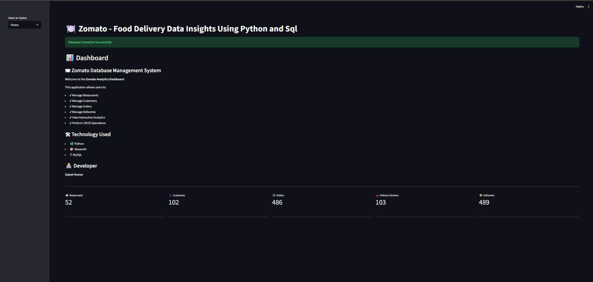

# Zomato Food Delivery Data Insights

A complete food-delivery data analysis and management application built using Python, Streamlit, MySQL, SQL, Pandas, Matplotlib, and Faker.

## Project Overview

This project analyzes and manages Zomato food-delivery data through an interactive Streamlit application connected to a MySQL database.

The application provides analytical dashboards, data visualization, SQL-based analysis, and CRUD operations for customers, restaurants, orders, delivery persons, and deliveries.

## Features

- Interactive Streamlit dashboard
- Restaurant analytics
- Customer analytics
- Order analytics
- Delivery person analytics
- Delivery analytics
- Data visualization and charts
- MySQL database connectivity
- SQL-based data analysis
- CRUD operations
- Add, update, and delete records
- Search customer/order/delivery-related records
- Faker-based dataset generation

## Technologies Used

| Technology | Purpose |
|---|---|
| Python | Application development |
| Streamlit | Interactive web application |
| MySQL | Database management |
| SQL | Data querying and analysis |
| Pandas | Data processing |
| Matplotlib | Data visualization |
| Faker | Synthetic dataset generation |
| Jupyter Notebook | Dataset generation and development |

## Database Entities

The project contains the following main entities:

- Customers
- Restaurants
- Orders
- Delivery Persons
- Deliveries

## Project Structure

```text
zomato-food-delivery-data-insights/
│
├── app.py
├── db.py
├── requirements.txt
├── README.md
├── .gitignore
│
├── customers.csv
├── restaurants.csv
├── orders.csv
├── delivery_persons.csv
├── deliveries.csv
│
├── zomato_data_generator.ipynb
│
└── Zomato_Project_Cover_Page_One_Page.docx

**Add it after `Zomato_Project_Cover_Page_One_Page.docx`.**

Then commit the change.

After that, GitHub should show **Application Preview as a heading and the actual screenshot underneath it**, rather than showing the Markdown code.

## Application Preview

